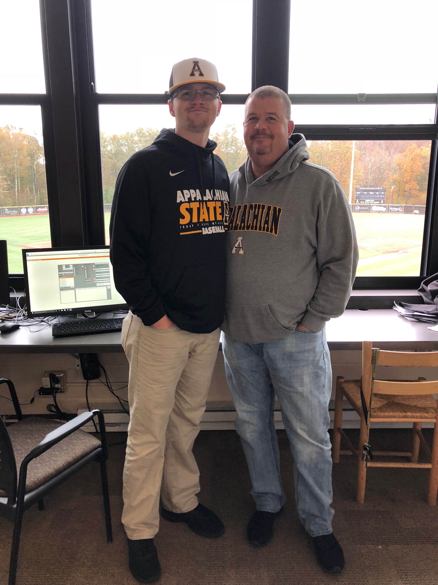
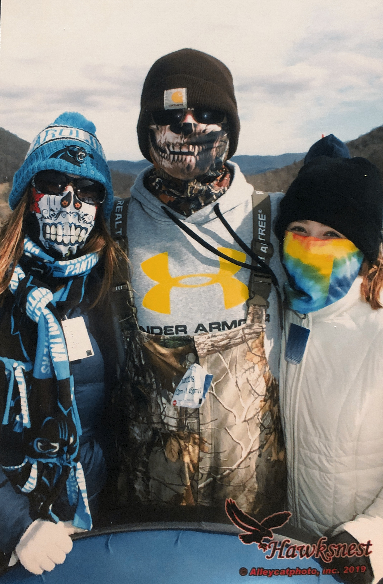

I am currently working towards my bachelor's degree in Recreation Management with a minor in Statistics. Working with the Appalachian State Baseball Team since the Fall of 2018, I have gained tremendous expertise in general coding with R. 

I am thankful for the many opportunities that I have been given including being around such a supporting family. My mother and close cousin are now beginning to feel accustomed to the cold conditions of Boone. Also my father has been nothing but helpful for my journey to become a proffesional baseball data analyst. 

 

*This site was last rendered on `r format(Sys.time(), "%A, %B %d, %Y at %X.")`*

